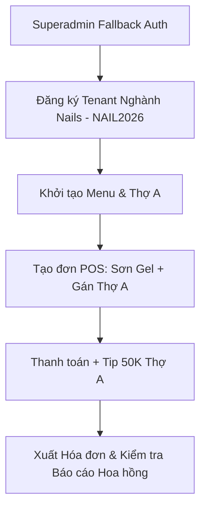

# 📋 BITPAW OS - KỊCH BẢN KIỂM THỬ THỦ CÔNG (MANUAL TEST CASES)
## LUỒNG NGHIỆP VỤ NGHÀNH NAILS & HR MANAGEMENT (END-TO-END)

---

- **Hệ thống:** BitPaw OS - SaaS POS & HR Management
- **Phân hệ Target:** Nails Niche / Multi-Tenant Architecture & Fallback Auth
- **Người soạn thảo:** Senior QA/QC Engineer
- **Phiên bản tài liệu:** v1.0.0-NAILS
- **Ngày lập:** 20/07/2026
- **Trạng thái:** 🟡 Đang chờ nghiệm thu (Ready for UAT/Manual Testing)

---

> [!IMPORTANT]
> **HƯỚNG DẪN DÀNH CHO TESTER / CEO:**
> Tài liệu được thiết kế tối ưu cho cả hiển thị kỹ thuật số và **in ấn trực tiếp ra giấy**. 
> Vui lòng thực hiện tuần tự từ **Phần 1 đến Phần 3**, đánh dấu tích `[x]` vào ô trống tương ứng sau khi mỗi bước test đạt kết quả mong đợi (**PASS**). Nếu có lỗi (**FAIL**), hãy ghi lại log sự cố ở phần Ghi chú/Bug Report phía dưới.

---

## 📊 TỔNG QUAN LUỒNG KIỂM THỬ (TEST SUITE OVERVIEW)



---

## 🔐 PHẦN 1: QUẢN TRỊ VIÊN CẤP CAO (SUPERADMIN & FALLBACK AUTH)

> **Mục tiêu:** Kiểm tra khả năng truy cập quản trị tối cao của hệ thống thông qua cơ chế Auth dự phòng (Fallback Auth dựa trên biến môi trường) nhằm đảm bảo vận hành ổn định ngay cả khi Database gặp sự cố.

| Ô Check | ID Test | Tên bước (Step Name) | Hành động thực hiện (Action) | Kết quả mong đợi (Expected Result) | Trạng thái |
| :---: | :---: | :--- | :--- | :--- | :---: |
| [ ] | **TC-SA-001** | Trích xuất Fallback Credentials | Kiểm tra file cấu hình `.env` hoặc hệ thống Vercel Environment Variables để lấy thông tin đăng nhập khẩn cấp (`SUPERADMIN_EMAIL` và `SUPERADMIN_FALLBACK_HASH`). | Đã xác định được email Superadmin và chuỗi Hash Scrypt khẩn cấp hợp lệ. | PASS / FAIL |
| [ ] | **TC-SA-002** | Ngắt/Bypass truy vấn Database (Simulation) | Giả lập tình huống Database rơi vào trạng thái cô lập hoặc gián đoạn kết nối chính. | Hệ thống sẵn sàng kích hoạt luồng xác thực dự phòng Fallback Auth mà không crash app (`500 Internal Error`). | PASS / FAIL |
| [ ] | **TC-SA-003** | Đăng nhập Superadmin khẩn cấp | 1. Mở trình duyệt truy cập đường dẫn `/login`.<br>2. Nhập thông tin Email Superadmin và Mật khẩu tương ứng với Hash Scrypt Fallback.<br>3. Bấm **Đăng nhập**. | 1. Hệ thống xác thực thành công vượt qua cơ chế Bypass DB.<br>2. Chuyển hướng người dùng thẳng vào **Admin Dashboard** (`/admin` hoặc hệ thống quản trị trung tâm).<br>3. Hiển thị thông báo chào mừng Superadmin với đầy đủ quyền hạn tối cao. | PASS / FAIL |
| [ ] | **TC-SA-004** | Kiểm tra quyền Quản trị Tối cao | Truy cập các menu quản trị Tenant, danh sách hệ thống, xem thông tin giám sát và log. | Mọi tính năng Superadmin hoạt động bình thường, dữ liệu hệ thống hiển thị đầy đủ, không xuất hiện lỗi truy vấn. | PASS / FAIL |

---

## 🏢 PHẦN 2: LUỒNG END-TO-END TIỆM NAILS (TENANT MỚI ONBOARDING)

> **Mục tiêu:** Kiểm tra quy trình tự động khởi tạo Tenant mới chuyên biệt cho ngành Nails khi đăng ký qua Landing Page và cấu hình thiết lập ban đầu (Menu, Nhân sự).

### 2.1. Đăng ký & Onboarding Chuyên Biệt Nghành Nails

| Ô Check | ID Test | Tên bước (Step Name) | Hành động thực hiện (Action) | Kết quả mong đợi (Expected Result) | Trạng thái |
| :---: | :---: | :--- | :--- | :--- | :---: |
| [ ] | **TC-OB-001** | Truy cập Landing Page | Mở trình duyệt, truy cập trang chủ BitPaw (`/` hoặc `/landing`). Bấm nút **Dùng thử miễn phí** hoặc **Đăng ký ngay**. | Hiển thị Form đăng ký Tenant mới đầy đủ các trường thông tin tiêu chuẩn. | PASS / FAIL |
| [ ] | **TC-OB-002** | Nhập Form đăng ký với mã Niche Nails | Điền đầy đủ thông tin:<br>- Tên tiệm: `Nail Studio Luxury`<br>- Số điện thoại/Email đại diện<br>- **Mã đăng ký ngành:** Nhập `NAIL2026`<br>- Mật khẩu quản trị tiệm.<br>Bấm **Hoàn tất đăng ký**. | 1. Hệ thống thông báo Đăng ký thành công.<br>2. Tự động sinh `Tenant ID` và cơ sở dữ liệu riêng cho tiệm.<br>3. Áp dụng template mặc định chuyên biệt dành cho ngành Nails (Thuật ngữ: Thợ Nail, Dịch vụ Làm Da/Sơn Gel, Quản lý Tip, Hoa hồng thợ). | PASS / FAIL |
| [ ] | **TC-OB-003** | Đăng nhập Tenant Chủ Tiệm | Mở giao diện đăng nhập dành cho Chủ tiệm (`/login`), nhập Email/SĐT và Mật khẩu vừa tạo. | Đăng nhập thành công, chuyển hướng vào Dashboard quản trị của `Nail Studio Luxury`. | PASS / FAIL |

### 2.2. Thiết lập Menu Dịch Vụ Mẫu (Catalog Management)

| Ô Check | ID Test | Tên bước (Step Name) | Hành động thực hiện (Action) | Kết quả mong đợi (Expected Result) | Trạng thái |
| :---: | :---: | :--- | :--- | :--- | :---: |
| [ ] | **TC-MN-001** | Tạo Danh mục Dịch vụ Nails | 1. Đăng nhập quyền Chủ tiệm.<br>2. Vào menu **Quản lý Dịch vụ / Menu** -> Chọn **Thêm Danh Mục**.<br>3. Nhập tên danh mục: `Nails Care`. Bấm **Lưu**. | 1. Thông báo thêm danh mục thành công.<br>2. Danh mục `Nails Care` xuất hiện trong danh sách hiển thị với trạng thái Khả dụng (Active). | PASS / FAIL |
| [ ] | **TC-MN-002** | Tạo Dịch vụ 1 (Cắt da) | 1. Chọn **Thêm Dịch Vụ Mới**.<br>2. Nhập thông tin:<br>   - Tên dịch vụ: `Cắt da`<br>   - Danh mục: `Nails Care`<br>   - Giá tiền: `50,000 VNĐ`<br>   - Thời gian dự kiến: `20 phút`<br>3. Bấm **Lưu dịch vụ**. | Dịch vụ `Cắt da` được tạo thành công với đúng đơn giá 50,000 VNĐ và gắn khớp vào danh mục `Nails Care`. | PASS / FAIL |
| [ ] | **TC-MN-003** | Tạo Dịch vụ 2 (Sơn Gel) | 1. Chọn **Thêm Dịch Vụ Mới**.<br>2. Nhập thông tin:<br>   - Tên dịch vụ: `Sơn Gel`<br>   - Danh mục: `Nails Care`<br>   - Giá tiền: `150,000 VNĐ`<br>   - Thời gian dự kiến: `45 phút`<br>3. Bấm **Lưu dịch vụ**. | Dịch vụ `Sơn Gel` được tạo thành công với đúng đơn giá 150,000 VNĐ, nằm trong danh mục `Nails Care`. | PASS / FAIL |

### 2.3. Thiết lập Nhân sự / Thợ Nail (HR & Staff Management)

| Ô Check | ID Test | Tên bước (Step Name) | Hành động thực hiện (Action) | Kết quả mong đợi (Expected Result) | Trạng thái |
| :---: | :---: | :--- | :--- | :--- | :---: |
| [ ] | **TC-HR-001** | Thêm mới Thợ Nail | 1. Truy cập menu **Quản lý Nhân sự / Nhân viên**.<br>2. Bấm **Thêm Nhân viên Mới**.<br>3. Nhập:<br>   - Họ & Tên: `Thợ A`<br>   - Vị trí/Chức danh: `Kỹ thuật viên Nails`<br>   - Tỷ lệ hoa hồng dịch vụ: `10%` (hoặc cấu hình theo tiệm).<br>4. Bấm **Lưu nhân sự**. | Nhân viên `Thợ A` được thêm thành công vào hệ thống, hiển thị trên sơ đồ nhân viên khả dụng làm ca tại POS. | PASS / FAIL |

---

## 💅 PHẦN 3: VẬN HÀNH POS & THANH TOÁN (CORE BUSINESS FLOW)

> **Mục tiêu:** Kiểm tra luồng tạo đơn hàng, chỉ định thợ làm dịch vụ, tính tiền Tip cho thợ, in hóa đơn và đối soát hoa hồng/thu nhập chính xác.

### 3.1. Tạo Đơn Hàng / Booking Dịch Vụ Tại Màn Hình POS

| Ô Check | ID Test | Tên bước (Step Name) | Hành động thực hiện (Action) | Kết quả mong đợi (Expected Result) | Trạng thái |
| :---: | :---: | :--- | :--- | :--- | :---: |
| [ ] | **TC-POS-001** | Mở Giao diện Thu ngân / POS | Lễ tân/Thu ngân đăng nhập vào giao diện bán hàng POS (`/pos` hoặc `/app_nhanvien`). | Màn hình POS tải nhanh chóng, hiển thị danh mục `Nails Care` và 2 dịch vụ `Cắt da`, `Sơn Gel`. | PASS / FAIL |
| [ ] | **TC-POS-002** | Chọn Dịch vụ & Gán Thợ | 1. Click chọn dịch vụ `Sơn Gel` (150,000 VNĐ) vào giỏ hàng.<br>2. **BẮT BUỘC:** Click mở ô chọn Thợ làm -> Chọn người thực hiện là `Thợ A`. | 1. Giỏ hàng hiển thị `Sơn Gel` - Giá: `150,000 VNĐ`.<br>2. Thông tin Kỹ thuật viên thực hiện hiển thị rõ ràng là `Thợ A`. | PASS / FAIL |

### 3.2. Tính Tiền Tip & Thanh Toán Hóa Đơn

| Ô Check | ID Test | Tên bước (Step Name) | Hành động thực hiện (Action) | Kết quả mong đợi (Expected Result) | Trạng thái |
| :---: | :---: | :--- | :--- | :--- | :---: |
| [ ] | **TC-PAY-001** | Nhập tiền Tip cho Thợ A | 1. Bấm nút **Thanh toán**.<br>2. Tại giao diện nhập tiền Tip/Tiền thưởng:<br>   - Chọn chỉ định Tip cho: `Thợ A`<br>   - Số tiền Tip: `50,000 VNĐ`. | Hệ thống ghi nhận số tiền Tip 50,000 VNĐ thuộc sở hữu riêng của `Thợ A` cho đơn hàng này. | PASS / FAIL |
| [ ] | **TC-PAY-002** | Thực hiện Thanh toán | 1. Chọn phương thức thanh toán (Tiền mặt / Chuyển khoản QR).<br>2. Xác nhận tổng số tiền thu của khách:<br>   `Dịch vụ (150K) + Tip (50K) = 200,000 VNĐ`.<br>3. Bấm **Hoàn tất đơn hàng**. | 1. Đơn hàng chuyển sang trạng thái **Đã thanh toán** (Completed).<br>2. Dữ liệu doanh thu & tiền Tip được ghi nhận ngay lập tức vào cơ sở dữ liệu realtime. | PASS / FAIL |

### 3.3. In Hóa Đơn (Bill Print) & Kiểm Trực Thu Nhập Hoa Hồng

| Ô Check | ID Test | Tên bước (Step Name) | Hành động thực hiện (Action) | Kết quả mong đợi (Expected Result) | Trạng thái |
| :---: | :---: | :--- | :--- | :--- | :---: |
| [ ] | **TC-INV-001** | Xuất & Xem Giao diện Bill | Mở bản in bill xem trước (Preview) hoặc in trực tiếp ra máy in hóa đơn. | Hóa đơn xuất ra phải hiển thị chính xác và rõ ràng:<br>- Tên dịch vụ: `Sơn Gel` - `150,000 VNĐ`<br>- Thợ thực hiện: `Thợ A`<br>- Tiền Tip (Thợ A): `50,000 VNĐ`<br>- **Tổng cộng thanh toán:** `200,000 VNĐ`. | PASS / FAIL |
| [ ] | **TC-RPT-001** | Đối soát Báo cáo Thu nhập Thợ A | 1. Vào menu **Báo cáo Nhân sự / Hoa hồng & Tip** hoặc mở giao diện app cá nhân của nhân viên (`/app_nhanvien`).<br>2. Chọn xem báo cáo trong ngày của `Thợ A`. | Báo cáo chi tiết thu nhập hiển thị chính xác:<br>1. Doanh số dịch vụ thực hiện: `150,000 VNĐ`.<br>2. Hoa hồng dịch vụ: Tùy theo % cấu hình (VD 10% = `15,000 VNĐ`).<br>3. Tiền Tip trực tiếp: Đúng `50,000 VNĐ`.<br>4. **Tổng tiền Thợ A nhận được cho đơn:** Hoa hồng dịch vụ + `50,000 VNĐ` Tip. | PASS / FAIL |

---

## 📝 TỔNG KẾT & KÝ XÁC NHẬN NGHIỆM THU (SIGN-OFF)

| Chỉ số nghiệm thu | Kết quả thực tế |
| :--- | :--- |
| **Tổng số Test Cases:** | **11 Cases** |
| **Số lượng PASS:** | `[   ] / 11` |
| **Số lượng FAIL:** | `[   ] / 11` |
| **Tỷ lệ Đạt (Pass Rate):** | `....... %` |

### 📌 GHI CHÚ BÁO CÁO LỖI (BUG LOG) IF ANY:
```text
____________________________________________________________________________________________________
____________________________________________________________________________________________________
____________________________________________________________________________________________________
```

### 🖋️ CHỮ KÝ XÁC NHẬN:

| **SENIOR QA/QC ENGINEER** | **TRƯỞNG NHÓM KỸ THUẬT (LEAD DEV)** | **GIÁM ĐỐC ĐIỀU HÀNH (CEO / PRODUCT OWNER)** |
| :---: | :---: | :---: |
| *(Ký & Ghi rõ họ tên)* | *(Ký & Ghi rõ họ tên)* | *(Ký & Ghi rõ họ tên)* |
| <br><br>**Đã kiểm thử** | <br><br>**Đã sửa lỗi & Duyệt** | <br><br>**Chấp nhận Nghiệm thu (Sign-off)** |
